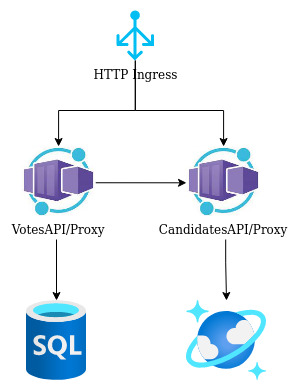

## How to execute the election API sample using Docker and Azure Container Instances

### Prerequisites
- Azure account
- Docker
- VSCode
- Azure extension on VSCode
- .Net 6 SDK

### Architecture Local With Docker Compose


First let's create an [Azure Container Registry](https://docs.microsoft.com/en-us/azure/container-registry/container-registry-get-started-portal?tabs=azure-cli), inside Azure Portal.

Build docker images inside the project, tag them with registry name and push to private container registry Azure.
Now create the databases [Azure SQL Database](https://docs.microsoft.com/en-us/azure/azure-sql/database/single-database-create-quickstart?view=azuresql&tabs=azure-portal) and [CosmosDB API MongoDB](https://docs.microsoft.com/en-us/azure/cosmos-db/mongodb/create-mongodb-java).

Using Azure, we have three simple ways to host containers, [Azure Container Instances](https://docs.microsoft.com/en-us/azure/container-instances/container-instances-quickstart-portal), [Azure App Service](https://docs.microsoft.com/en-us/azure/app-service/quickstart-dotnetcore?tabs=net60&pivots=development-environment-vs) and [Azure Container Apps](https://docs.microsoft.com/en-us/azure/container-apps/quickstart-portal). We have the diagram hosting application in all the services. Any options you choose, don't forget to set environment variables to connect to databases, variable's examples are inside docker compose file.

When we are using ACI, the simpler way is just run the APIs images, without Proxy Reverse. Although Azure App service are a good way to run two containers, API e Proxy Reverse together and Azure Container Apps comes with Http Ingress for basic control.

Locally just run ```` docker compose up --build ```` at root folder.

### Architecture Local With Azure App Service and Docker Compose


App Service is an PaaS Serveless, you can deploy only your code, using runtimes supported by Azure, or run containers. One App Service hosts more than one container, it's scales vertically and horizontall, also supports auto-scale but you don't have fine control over network or deploy strategies.

### Architecture Local With Azure Container Instances and Docker Compose


Azure Container Instances it's like to have your own Docker/Docker Compose at Azure, with the same features and limitations. ACI doesn't support auto-scaling or deploy strategies, but you have an environment similar do Docker local.

### Architecture Local With Azure Container Apps


Azure Container Apps is an Kubernetes without complexity, but not all features are available. Also you have KEDA and Dapr for event driven applications and a solution of side-car. Supports auto scaling and some deploy strategies, like traffic splitting.